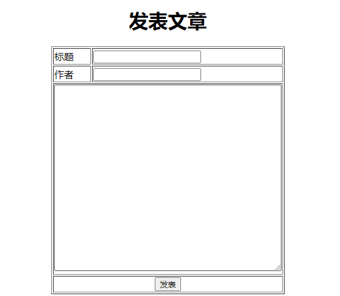

# 总结:
## 一.该项目通过与数据库连接(JDBC)获取信息,实现动态页面

### 1.处理用户注册

### 2.处理用户登录

### 3.生成用户列表

### 4.实现发表文章的功能

### 5.处理文章列表

### 6.查询文章内容

## 二.六个功能的具体实现
### 1.处理用户注册
#### 用户注册主要以建立HTML页面,添加表单后根据表单提交的地址和请求方式在Java文件UserController类中添加@RequestMapping()注解传递表单地址来处理并实现业务
#### 代码目前有三种:
##### (1).根据提供的原始传参写法:
    public void reg(HttpServletRequest request,HttpServletResponse response){}
##### (2).根据SpringMVC框架:将处理业务需要用到的表单上的信息直接进行传递,该传参的优点是不需要判断传入的值是否判断,只要规定了数据类型,用户在注册时必须遵循,否则系统会报错!
    public void reg(String username,String password,String nickname,int age, HttpServletResponse response) {}
##### (3).根据底层反射,直接传递对象(需要私有化属性,getter和setter方法,无参构造器,重写toString等行业标准写法),利用getter来获取用户注册的信息
    public void reg(User user, HttpServletResponse response){}
#### 最后获取到信息并验证后通过JDBC与数据库建立连接,先判断用户是否存在,再向MySQL插入需要保存的信息,根据保存结果来response相应页面
##### (1).判断用户是否存在写法如下:
    //判断用户是否存在
    String sql = "SELECT 1 FROM userinfo WHERE username=?";
    //查1代表如果WHERE条件成立就能显示1,反之不显示,可以用来判断WHERE条件是否成立
    PreparedStatement ps = connection.prepareStatement(sql);
    ps.setString(1,username);
    //★该方法会返回一个ResultSet对象，这个对象封装了查询出来的结果集。
    ResultSet rs = ps.executeQuery();
    //如果WHERE条件成立说明此次用户名和上一次相同,可查到数字1,next()方法为true
    if (rs.next()) { //判断结果集是否有一条记录
    response.sendRedirect("/have_user.html");
    return;
    }
##### (2).向SQL中插入信息
    sql = "INSERT INTO userinfo (username,password,nickname,age) " +
    "VALUES(?,?,?,?)";
    ps = connection.prepareStatement(sql);
    ps.setString(1,username);
    ps.setString(2,password);
    ps.setString(3,nickname);
    ps.setInt(4,age);
    int num = ps.executeUpdate();//★该方法返回影响了多少条记录
    if (num > 0) { //若影响的条数大于0则说明插入成功
       response.sendRedirect("/reg_success.html");
    }
### 2.处理用户登录
#### 用户登录主要以建立HTML页面,添加表单后根据表单提交的地址和请求方式在Java文件UserController类中添加@RequestMapping()注解传递表单地址来处理并实现业务(也可以使用SpringMVC和对象的传参方式获取信息)
#### 该功能主要验证用户名和密码是否正确来判断登录的结果,先利用JDBC与数据库建立连接使用PreparedStatement预编译执行SQL语句,该类接收拿到的SQL语句并生成执行计划,提高处理效率!
    try(
            Connection connection = DBUtil.getConnection()
    ){
        String sql = "SELECT id,username,password,nickname,age "+
                     "FROM userinfo "+
                     "WHERE username=? "+
                     "AND password=?";
        PreparedStatement ps = connection.prepareStatement(sql);
        //拿到登录需要的用户名和密码,查询信息,若能查到说明账户密码正确
        ps.setString(1,username);
        ps.setString(2,password);
        ResultSet rs = ps.executeQuery();//★该方法会返回一个ResultSet对象，这个对象封装了查询出来的结果集。
        if (rs.next()){ //该方法判断是否有一条记录
             response.sendRedirect("/login_success.html");//若能查到记录,则登录成功！
        }else {
             response.sendRedirect("/login_fail.html");//若查询不到记录,登录失败！
        }
    }catch (SQLException | IOException throwables){
         throwables.printStackTrace();
    }
### 3.生成用户列表(体现动态页面)
#### 生成动态页面主要根据用户的注册来不断刷新页面信息实现动态效果,需新定义一个表单路径并添加注解@RequestMapping(),查询数据库中用户的所有信息,利用HTML页面来呈现每个用户的信息列表
##### (1).通过JDBC获取数据库中用户的信息
    //获取userinfo表中的信息
    String sql ="SELECT id,username,password,nickname,age FROM userinfo";
    PreparedStatement ps = connection.prepareStatement(sql);
    ResultSet rs = ps.executeQuery();//★该方法会返回一个ResultSet对象，这个对象封装了查询出来的结果集。
##### (2).通过response.getWriter()之前设置响应头，告知浏览器正文类型和字符集，避免页面乱码,再通过response.getWriter()获取的缓冲字符流写出的内容会作为正文发送给浏览器,此时写出的为一个HTML页面,在定义完内容后添加信息时讲信息设置为通过SQL获取的信息利用while循环来实现动态改变,这里给用户名添加超链接,定义路径通过get请求传递信息,点击查看文章列表
    while(rs.next()) {//-------此处体现了动态页面的特点,随着用户的注册不断改变！
    int id = rs.getInt("id");//将查询到的"id"获取并赋值给id
    String userAuthor = rs.getString("username");//将查询到的"username"获取并赋值给userAuthor
    pw.println("            <tr>");
    pw.println("                <td>"+id+"</td>");//利用get请求来获取抽象路径后表单的信息,这里作者就是username
    //加入一个新的超链接,定义抽象路径articleList,传递信息userId,userAuthor
    pw.println("                <td><a href='/articleList?userId="+id+"&userAuthor="+userAuthor+"' >"+userAuthor+"</a></td>");
    pw.println("                <td>"+rs.getString("password")+"</td>");
    pw.println("                <td>"+rs.getString("nickname")+"</td>");
    pw.println("                <td>"+rs.getInt("age")+"</td>");
    pw.println("            </tr>");
    }
### 4.实现发表文章的功能
#### 实现该功能与注册和登录类似,现在static静态资源下创建HTML页面,添加表单和提交地址以及请求方式,然后在ArticleController类中创建处理该功能的方法write并添加注解@RequestMapping()传递表单地址,进行功能处理
#### 该功能主要实现发表文章,因此在发表前需要验证内容格式是否正确,保证该前提后与SQL建立连接,根据作者名来查询数据库中对应的用户名,用户名存在后,将发表的内容和标题插入到article表中,根据结果反馈页面
##### (1).通过作者名来验证SQL中是否存在该用户反馈结果集并查询后面需要信息,存在则插入article表中,若不存在则反馈页面:
    //根据表单上用户输入的作者名author对应userinfo表中的用户名为过滤条件来查找信息
    String sql = "SELECT username,id " +
                 "FROM userinfo " +
                 "WHERE username=?";
    PreparedStatement ps = connection.prepareStatement(sql);//预编译生成执行计划！
    ps.setString(1,author);
    ResultSet rs = ps.executeQuery();//★该方法会返回一个ResultSet对象，这个对象封装了查询出来的结果集。
##### (2).将用户输入的文章内容和标题以及id插入到数据库article表中进行保存,其中id需要向前面获取,当通过作者名对应完信息后即可插入信息:
    int id = rs.getInt("id");//获取查找的id
    //将用户表单和查询的id插入到article表中
    String sql1 = "INSERT INTO article(title,content,u_id) VALUES(?,?,?)";
    PreparedStatement ps1 = connection.prepareStatement(sql1);
    ps1.setString(1,title);
    ps1.setString(2,content);
    ps1.setInt(3,id);
    int num = ps1.executeUpdate();//插入,影响内容
    if (num>0){//检测影响的条数>0,发表成功
    response.sendRedirect("/write_article_success.html");
    }else {
    response.sendRedirect("/write_article_fail.html");
    }
### 5.处理文章列表
#### 处理文章列表功能主要也是实现动态页面,当一个用户发表多篇文章后就会增加列表中的内容
#### 这里将表单路径设置为生成用户列表时超链接中?左边的抽象路径并获取?右边get请求传递的用户信息进行相应处理
#### 利用get请求获取的id对应article表中的u_id为条件查询该用户发表的每篇文章和标题,使用while循环添加进页面中呈现
##### (1).通过表单get请求获取的信息利用request进行获取,对应SQL过滤条件获得查询结果集
    String uid = request.getParameter("userId");
    String sql = "SELECT title,content " +
                 "FROM article " +
                 "WHERE u_id=?";
    PreparedStatement ps = connection.prepareStatement(sql);//传入SQL语句并生成执行计划
    ps.setInt(1,Integer.parseInt(uid));//将第一个？设置成传入转化后的int型用户ID
    ResultSet rs = ps.executeQuery();//查询结果集
#### (2).将获取的信息通过缓冲字符流写到HTML页面的对应内容中,再定义一个超链接中抽象路径与传递请求信息用来点击查看文章内容
    while (rs.next()){//-----------------此处反应出动态页面的特点
    String title1 = rs.getString(1);
    String content = rs.getString(2);
    pw.println("        <tr>");
    pw.println("            <td><a href='/lookArticle?content="+content+"' >"+title1+"</a></td>");
    pw.println("            <td>"+author+"</td>");
    pw.println("        </tr>");
    }
### 6.查询文章内容
#### 查看文章的功能较为简单,因为所需要的文章在处理文章列表点击超链接后已经获取该用户的content,故只需定义方法添加@RequestMapping()注解获取文章内容content将该文章放到HTML内容中即可
    String content = request.getParameter("content");//接收通过request获得的表单信息
    pw.println("        <tr>");
    pw.println("            <td>
文章内容
</td>");
    pw.println("        </tr>");
    pw.println("        <tr>");
    pw.println("            <td>"+content+"</td>");
    pw.println("        </tr>");
## 以上为该项目的实现总结!